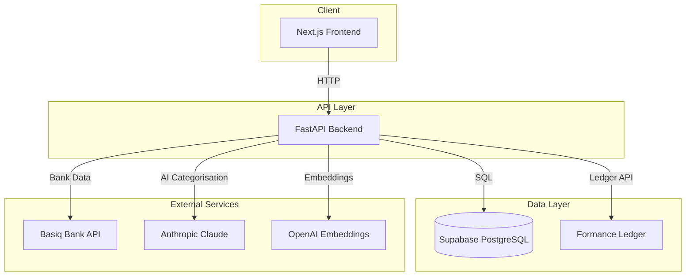
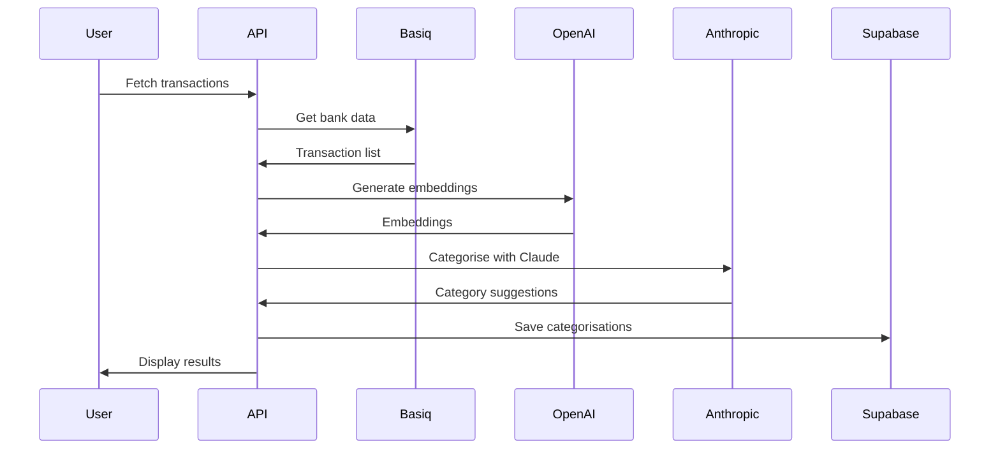

# Smart GL Architecture

## High-Level Diagram

## Component Overview

### Frontend (apps/web)
- **Framework**: Next.js 15 with App Router
- **UI**: React 18, Tailwind CSS, shadcn/ui
- **Charts**: Recharts
- **Port**: 3000

### Backend (apps/api)
- **Framework**: FastAPI (Python 3.12)
- **Database**: Supabase (PostgreSQL + pgvector + RLS)
- **Ledger**: Formance Ledger v2
- **Port**: 8000

### Routers

| Router | Path | Description |
|--------|-----|-------------|
| transactions | /transactions | Transaction CRUD |
| journal | /journal | Journal entries |
| reports | /reports | Financial reports |
| accounts | /accounts | Chart of accounts |
| basiq | /basiq | Bank feed integration |

### Services

| Service | Purpose |
|---------|---------|
| categorise.py | AI transaction categorization |
| basiq.py | Basiq API integration |
| formance.py | Formance Ledger interface |

## Database Schema

### Core Tables

- `tenants` - Multi-tenant isolation
- `accounts` - Chart of accounts
- `transactions` - Bank transactions
- `categorisations` - AI categorisation results
- `journal_entries` - Double-entry records

### Key Conventions

- **Monetary values**: Stored as cents (integers)
- **Time zone**: UTC in DB, Australia/Sydney for display
- **Soft deletes**: `deleted_at` field
- **Tenant isolation**: RLS + `app.current_tenant_id`

## Data Flow

### Transaction Categorisation

## Security

- **Tenant isolation**: Row-level security (RLS)
- **API keys**: Environment variables only
- **Authentication**: Bearer tokens (future: Supabase Auth)

## Deployment

| Component | Platform |
|-----------|-----------|
| Frontend | Vercel |
| Backend | Fly.io |
| Database | Supabase |
| Ledger | Docker (self-hosted) |